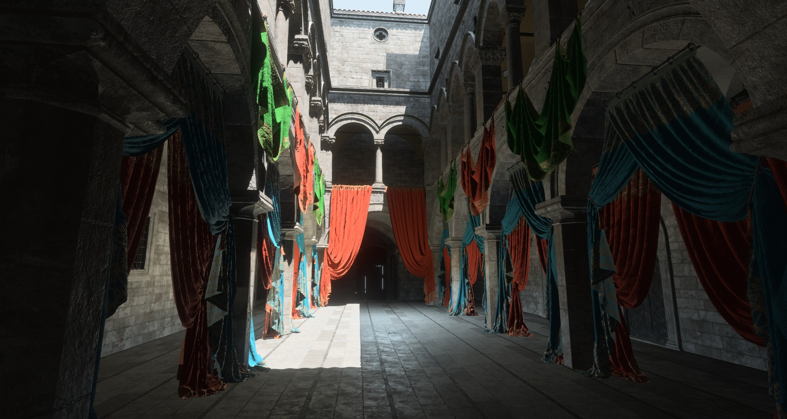

# Bevy Sponza Example Scene

Download [Sponza Base Scene and Colorful Curtains](https://www.intel.com/content/www/us/en/developer/topic-technology/graphics-research/samples.html).

Extract the files into `./assets/main_sponza/` and `./assets/PKG_A_Curtains/`

No GI, just aiming lights where there should be light.

To optionally convert the textures to KTX2 use: `cargo run -- --convert`. You need [kram](https://github.com/alecazam/kram) in your path to do this. It will convert all the textures to BC7 KTX2 zstd 0 using `available_parallelism()` and update the gltf files to use the KTX2 textures.